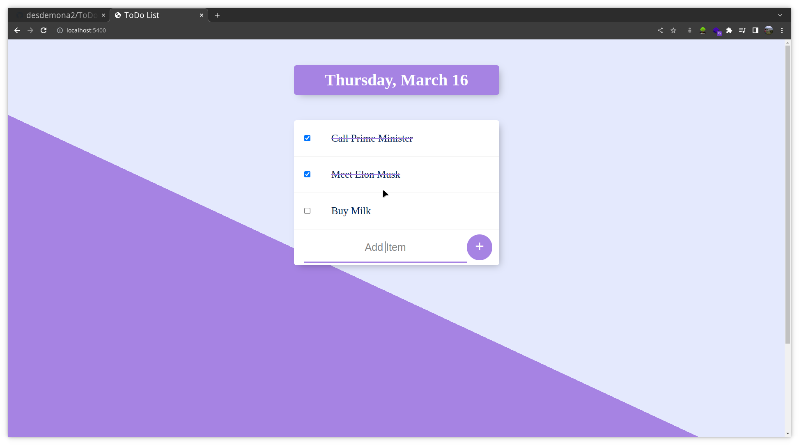

# ToDo App Demo

This is a very basic application demonstrating of:

- Share Data between client and server
- Update Client UI based on Data received from Client itself

# Screenshot

# What i am think of doing with this in near Future

1. Connecting it with firebase authenticator.
2. Save user data using firebase database.
3. Creating a cross-platform android app which will be linked with same firebase database to fetch data.
